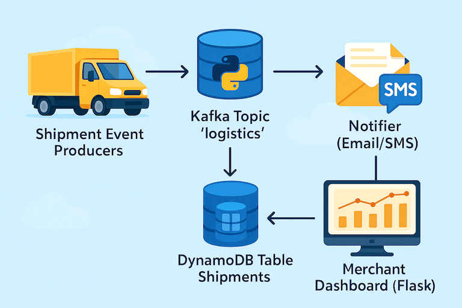
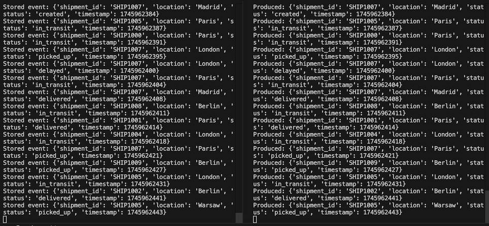
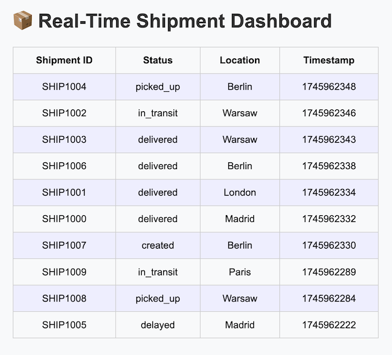

# Event-Driven Logistics Tracking Platform

Designed a real-time logistics event processing system (#SupplyChainTechnology, #EventDrivenArchitecture) to track shipments, warehouse movements, and customer notifications. Built using Kafka, Python, and DynamoDB to ensure high-throughput, low-latency operations across multiple geographies.

Delivered a merchant-facing dashboard to provide real-time shipment visibility, enhancing platform reliability and operational transparency.

## Architecture Overview

- **Event Source**: Producers emit shipment and warehouse events into Kafka topics.
- **Kafka Broker**: Manages event streaming and distribution.
- **Consumer Service**: Listens to events, processes data, and writes into DynamoDB.
- **DynamoDB**: Stores shipment and warehouse state information.
- **Notifier Service**: Sends real-time updates to customers.
- **Dashboard**: Flask app allowing merchants to view shipment status.



## Project Structure

```
event-driven-logistics/
├── app/
│   ├── producer.py
│   ├── consumer.py
│   ├── notifier.py
│   └── dashboard/
│       ├── app.py
│       ├── templates/
│       │   └── dashboard.html
│       └── static/
│           └── style.css
├── config/
│   ├── kafka_config.py
│   └── dynamodb_config.py
├── deployment/
│   ├── setup_dynamodb.py
│   ├── docker-compose.yml
│   └── requirements.txt
├── scripts/
│   └── generate_mock_events.py
├── main.py
└── Makefile
```

## How to Run

1. **Set up Kafka and DynamoDB**:
   ```bash
   make run-localstack
   ```

2. **Create the table**:
   ```bash
   make create-table
   ```

3. **Run the platform**:
   ```bash
   make start-consumer
   make start-producer
   make start-dashboard
   ```

4. **Or launch everything together**:
   ```bash
   python3 main.py
   ```

5. **View dashboard**:
   - Open: [http://localhost:5000](http://localhost:5000)

## Key Technologies

- Apache Kafka (event streaming)
- Python (event processing and dashboard)
- Amazon DynamoDB (state storage)
- Flask (dashboard web app)

---

## Screenshots

### 🧪 Terminal — Producer + Consumer Output



### 📊 Real-Time Shipment Dashboard


