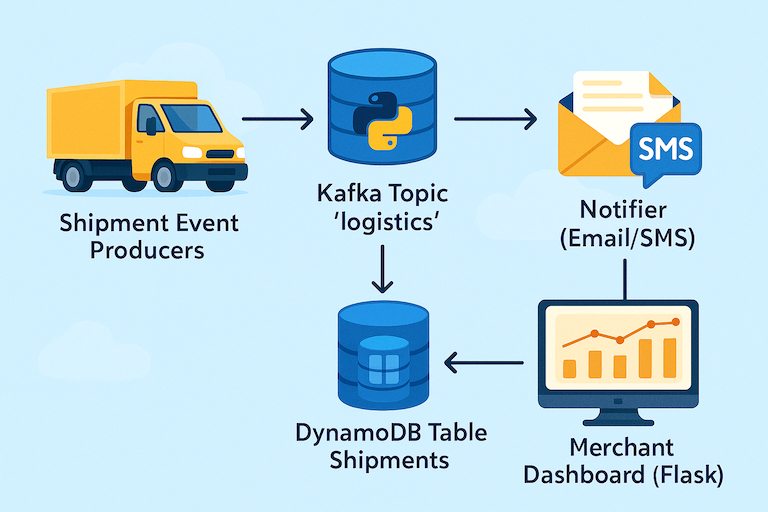
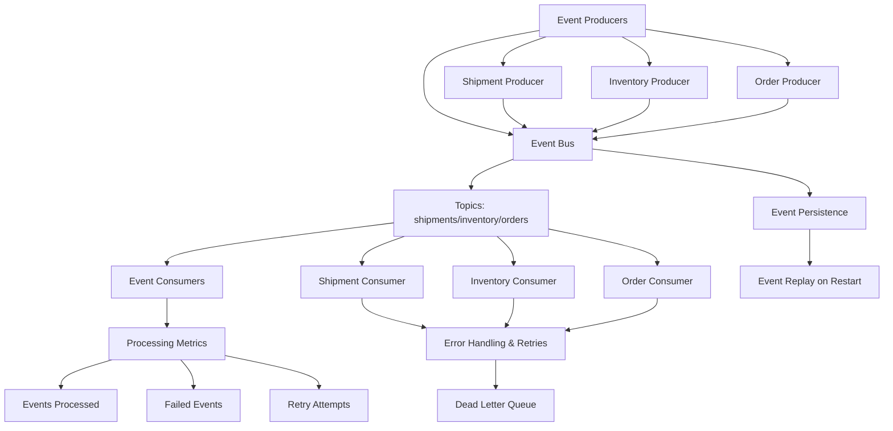

# Event-Driven Logistics Tracking Platform

This repository contains an advanced event-driven logistics simulation with multiple topics, persistence, error handling, and metrics. Producers emit shipment, inventory, and order events into topic-based queues, with consumers processing them asynchronously.




```mermaid
flowchart TD
    Producers[Event Producers] --> Bus[Event Bus]
    Bus --> Topics[Topics: shipments/inventory/orders]
    Topics --> Consumers[Event Consumers]

    Producers --> ShipmentProducer[Shipment Producer]
    Producers --> InventoryProducer[Inventory Producer]
    Producers --> OrderProducer[Order Producer]

    ShipmentProducer --> Bus
    InventoryProducer --> Bus
    OrderProducer --> Bus

    Bus --> Persistence[Event Persistence]
    Persistence --> Replay[Event Replay on Restart]

    Topics --> ShipmentConsumer[Shipment Consumer]
    Topics --> InventoryConsumer[Inventory Consumer]
    Topics --> OrderConsumer[Order Consumer]

    Consumers --> Metrics[Processing Metrics]
    Metrics --> Processed[Events Processed]
    Metrics --> Failed[Failed Events]
    Metrics --> Retries[Retry Attempts]

    ShipmentConsumer --> ErrorHandling[Error Handling & Retries]
    InventoryConsumer --> ErrorHandling
    OrderConsumer --> ErrorHandling

    ErrorHandling --> DeadLetter[Dead Letter Queue]
```

---

## 📂 Project Structure

```
event-driven-logistics/
├── README.md
├── requirements.txt
├── main.py  # Advanced event bus with topics, persistence, threading
└── events.log  # Persisted events (created on run)
```

---

## 🚀 Running the Simulation

1. Create a virtual environment and install dependencies:

```bash
python -m venv venv
source venv/bin/activate
pip install -r requirements.txt
```

2. Run the main script:

```bash
python main.py
```

Producers will generate events across multiple topics, consumers will process them with error handling and retries.

---

## 🏗️ Features

- **Multi-Topic Queues**: Separate queues for shipments, inventory, orders
- **Event Persistence**: Events logged to file for replay
- **Error Handling**: Consumer failures with retry logic
- **Metrics Tracking**: Processed, failed, and retry counts
- **Threading**: Concurrent producers and consumers

---

## 📜 License

MIT License
