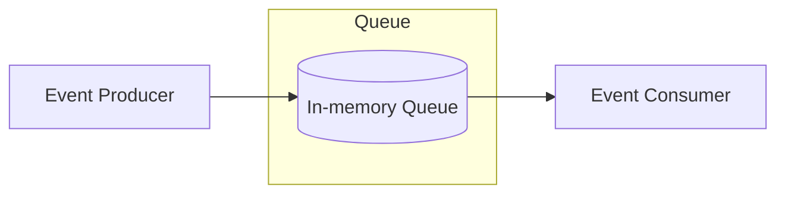

# Event-Driven Logistics Tracking Platform

This repository contains a minimal event-driven logistics simulation. A producer emits shipment events into an in-memory queue and a consumer processes them.


```mermaid
flowchart LR
    Producer[Event Producer]
    subgraph Queue
      Kafka[(In-memory Queue)]
    end
    Consumer[Event Consumer]
    Producer --> Kafka --> Consumer
```

---

## 📂 Project Structure

```
event-driven-logistics/
├── README.md
├── requirements.txt
└── main.py
```

---

## 🚀 Running the Simulation

1. Create a virtual environment and install dependencies:

```bash
python -m venv venv
source venv/bin/activate
pip install -r requirements.txt
```

2. Run the main script:

```bash
python main.py
```

The producer will enqueue a few events and the consumer will process and print them.

---

## 📜 License

MIT License
