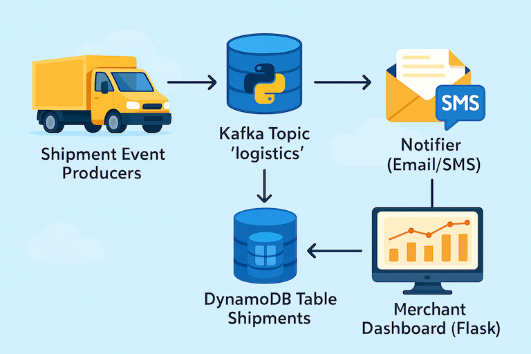
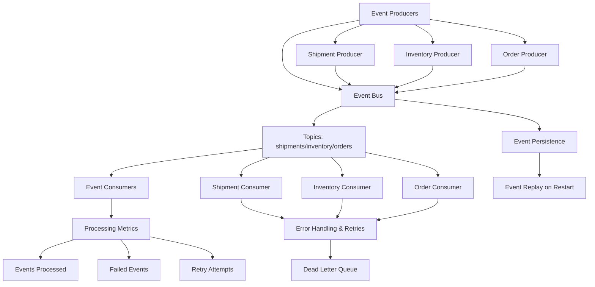

# Event-Driven Logistics Tracking Platform

This repository contains an advanced event-driven logistics simulation with multiple topics, persistence, error handling, and metrics. Producers emit shipment, inventory, and order events into topic-based queues, with consumers processing them asynchronously.




```mermaid
flowchart TD
    Producers[Event Producers] --> Bus[Event Bus]
    Bus --> Topics[Topics: shipments/inventory/orders]
    Topics --> Consumers[Event Consumers]

    Producers --> ShipmentProducer[Shipment Producer]
    Producers --> InventoryProducer[Inventory Producer]
    Producers --> OrderProducer[Order Producer]

    ShipmentProducer --> Bus
    InventoryProducer --> Bus
    OrderProducer --> Bus

    Bus --> Persistence[Event Persistence]
    Persistence --> Replay[Event Replay on Restart]

    Topics --> ShipmentConsumer[Shipment Consumer]
    Topics --> InventoryConsumer[Inventory Consumer]
    Topics --> OrderConsumer[Order Consumer]

    Consumers --> Metrics[Processing Metrics]
    Metrics --> Processed[Events Processed]
    Metrics --> Failed[Failed Events]
    Metrics --> Retries[Retry Attempts]

    ShipmentConsumer --> ErrorHandling[Error Handling & Retries]
    InventoryConsumer --> ErrorHandling
    OrderConsumer --> ErrorHandling

    ErrorHandling --> DeadLetter[Dead Letter Queue]
```

---

## 📂 Project Structure

```
event-driven-logistics/
├── README.md
├── requirements.txt
├── Makefile                     # Shortcuts for the full pipeline
├── main.py                      # Standalone in-memory simulation (no external services)
├── events.log                   # Persisted events (created on run)
├── app/
│   ├── producer.py              # Sends shipment events to Kafka
│   ├── consumer.py              # Reads Kafka events, stores them in DynamoDB
│   ├── notifier.py              # Polls DynamoDB, sends (mock) notifications
│   └── dashboard/               # Flask dashboard reading from DynamoDB
├── config/
│   └── dynamodb_config.py       # DynamoDB Local connection helper
├── deployment/
│   ├── docker-compose.yml       # Kafka, Zookeeper, DynamoDB Local
│   └── setup_dynamodb.py        # Creates the Shipments table
├── scripts/
│   └── generate_mock_events.py  # Burst of 100 mock events into Kafka
└── run-tmux.sh                  # Launches the whole pipeline in tmux windows
```

---

## 🚀 Running the Simulation

1. Create a virtual environment and install dependencies:

```bash
python -m venv venv
source venv/bin/activate
pip install -r requirements.txt
```

2. Run the standalone simulation:

```bash
python main.py
```

Producers will generate events across multiple topics, consumers will process them with error handling and retries.

---

## 🐳 Running the Full Pipeline (Kafka + DynamoDB + Dashboard)

Everything runs locally — no real AWS account or credentials are needed
(DynamoDB Local accepts dummy credentials, which the code sets for you).

```bash
make run-localstack    # Start Kafka, Zookeeper, and DynamoDB Local via Docker
make create-table      # Create the Shipments table in DynamoDB Local
make start-producer    # Terminal 1: emit shipment events into Kafka
make start-consumer    # Terminal 2: consume events, store in DynamoDB
make start-notifier    # Terminal 3: mock notifications on new shipments
make start-dashboard   # Terminal 4: Flask dashboard at http://localhost:5000
```

Optional: `python3 scripts/generate_mock_events.py` sends a burst of 100 mock
events, and `./run-tmux.sh` launches all of the above in a tmux session.

---

## 🏗️ Features

- **Multi-Topic Queues**: Separate queues for shipments, inventory, orders
- **Event Persistence**: Events logged to file for replay
- **Error Handling**: Consumer failures with retry logic
- **Metrics Tracking**: Processed, failed, and retry counts
- **Threading**: Concurrent producers and consumers

---

## 📜 License

MIT License
